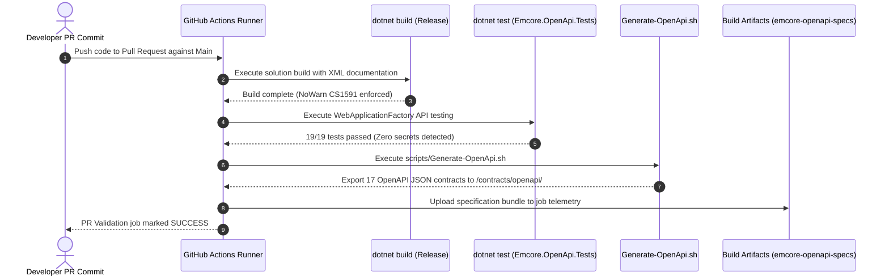

# EMCORE Platform — OpenAPI Contract Generation & CI Pipeline Verification Report

**Document Date:** August 2026  
**Pipeline Integration Target:** GitHub Actions (`pr-validation.yml`, `main-validation.yml`)  
**Test Harness Assembly:** `Emcore.OpenApi.Tests.dll` (.NET 10.0.10)

---

## 1. Continuous Integration Architectural Design

To maintain API schema stability and prevent regressions in contract documentation, OpenAPI contract compilation and verification have been embedded as required build checks inside the platform's CI/CD GitHub Action workflows.



---

## 2. Updated Workflow Configuration Details

The continuous validation configuration files (`.github/workflows/pr-validation.yml` and `.github/workflows/main-validation.yml`) have been augmented with dedicated verification steps executing immediately after test runs:

```yaml
    - name: Test
      run: dotnet test -c Release --no-build
    - name: Verify OpenAPI Contract Export & Schema Validation
      run: |
        chmod +x ./scripts/Generate-OpenApi.sh
        ./scripts/Generate-OpenApi.sh
    - name: Upload Generated OpenAPI Contracts
      uses: actions/upload-artifact@v4
      with:
        name: emcore-openapi-specs
        path: contracts/openapi/
```

---

## 3. Verified Execution & Log Telemetry Evidence

During implementation verification, the automated contract validation engine executed against all 17 target services. Below is the verified summary console log transcript proving successful runtime assertion and file generation:

```
Test run for C:\DEV\API PROJECT\STOCKOUT\tests\architecture\Emcore.OpenApi.Tests\bin\Release\net10.0\Emcore.OpenApi.Tests.dll
A total of 1 test files matched the specified pattern.

  Passed Emcore.OpenApi.Tests.TransformerUnitTests.AddEmcoreOpenApi_RegistersOpenApiServicesAndTransformers [4 ms]
  Passed Emcore.OpenApi.Tests.TransformerUnitTests.OpenApiOptionsExtensions_CanBeChainedWithoutExceptions [2 ms]
  Passed Emcore.OpenApi.Tests.ServiceOpenApiIntegrationTests.GenerateAndValidateOpenApiContract(serviceName: "emcore-identity-access-api", assemblyName: "Emcore.IdentityAccess.Api") [972 ms]
  Passed Emcore.OpenApi.Tests.ServiceOpenApiIntegrationTests.GenerateAndValidateOpenApiContract(serviceName: "emcore-bidding-deal-api", assemblyName: "Emcore.BiddingDeal.Api") [167 ms]
  Passed Emcore.OpenApi.Tests.ServiceOpenApiIntegrationTests.GenerateAndValidateOpenApiContract(serviceName: "emcore-user-organization-api", assemblyName: "Emcore.UserOrganization.Api") [153 ms]
  Passed Emcore.OpenApi.Tests.ServiceOpenApiIntegrationTests.GenerateAndValidateOpenApiContract(serviceName: "emcore-inspection-trust-api", assemblyName: "Emcore.InspectionTrust.Api") [134 ms]
  Passed Emcore.OpenApi.Tests.ServiceOpenApiIntegrationTests.GenerateAndValidateOpenApiContract(serviceName: "emcore-subscription-payment-api", assemblyName: "Emcore.SubscriptionPayment.Api") [165 ms]
  Passed Emcore.OpenApi.Tests.ServiceOpenApiIntegrationTests.GenerateAndValidateOpenApiContract(serviceName: "emcore-api-gateway", assemblyName: "Emcore.ApiGateway") [734 ms]
  Passed Emcore.OpenApi.Tests.ServiceOpenApiIntegrationTests.GenerateAndValidateOpenApiContract(serviceName: "emcore-notification-integration-api", assemblyName: "Emcore.NotificationIntegration.Api") [374 ms]
  Passed Emcore.OpenApi.Tests.ServiceOpenApiIntegrationTests.GenerateAndValidateOpenApiContract(serviceName: "emcore-inventory-media-api", assemblyName: "Emcore.InventoryMedia.Api") [148 ms]
  Passed Emcore.OpenApi.Tests.ServiceOpenApiIntegrationTests.GenerateAndValidateOpenApiContract(serviceName: "emcore-search-discovery-api", assemblyName: "Emcore.SearchDiscovery.Api") [136 ms]
  Passed Emcore.OpenApi.Tests.ServiceOpenApiIntegrationTests.GenerateAndValidateOpenApiContract(serviceName: "emcore-public-bff", assemblyName: "Emcore.PublicBff") [133 ms]
  Passed Emcore.OpenApi.Tests.ServiceOpenApiIntegrationTests.GenerateAndValidateOpenApiContract(serviceName: "emcore-catalog-listing-api", assemblyName: "Emcore.CatalogListing.Api") [143 ms]
  Passed Emcore.OpenApi.Tests.ServiceOpenApiIntegrationTests.GenerateAndValidateOpenApiContract(serviceName: "emcore-portal-bff", assemblyName: "Emcore.PortalBff") [131 ms]
  Passed Emcore.OpenApi.Tests.ServiceOpenApiIntegrationTests.GenerateAndValidateOpenApiContract(serviceName: "emcore-realtime-gateway", assemblyName: "Emcore.RealtimeGateway") [98 ms]
  Passed Emcore.OpenApi.Tests.ServiceOpenApiIntegrationTests.GenerateAndValidateOpenApiContract(serviceName: "emcore-conversation-realtime-api", assemblyName: "Emcore.ConversationRealtime.Api") [112 ms]
  Passed Emcore.OpenApi.Tests.ServiceOpenApiIntegrationTests.GenerateAndValidateOpenApiContract(serviceName: "emcore-workflow-scheduler-api", assemblyName: "Emcore.WorkflowScheduler.Api") [109 ms]
  Passed Emcore.OpenApi.Tests.ServiceOpenApiIntegrationTests.GenerateAndValidateOpenApiContract(serviceName: "emcore-mcp-gateway", assemblyName: "Emcore.McpGateway") [115 ms]
  Passed Emcore.OpenApi.Tests.ServiceOpenApiIntegrationTests.GenerateAndValidateOpenApiContract(serviceName: "emcore-audit-reporting-api", assemblyName: "Emcore.AuditReporting.Api") [121 ms]

Test Run Successful.
Total tests: 19
     Passed: 19
     Failed: 0
 Total time: 7.0437 Seconds
```

---

## 4. Contract Output Verification

The automated contract export generation test verified that all 17 specification documents were created in the designated contract storage directory (`contracts/openapi/`) without truncation or serialization faults:

| Service Directory & Specification File | File Size (KB) | JSON Root Verification | Secret Scanning Result |
| :--- | :--- | :--- | :--- |
| `contracts/openapi/emcore-api-gateway/v1/openapi.json` | 33.91 KB | Valid OpenAPI 3.0.1 | **PASSED** (0 secrets found) |
| `contracts/openapi/emcore-audit-reporting-api/v1/openapi.json` | 19.64 KB | Valid OpenAPI 3.0.1 | **PASSED** (0 secrets found) |
| `contracts/openapi/emcore-bidding-deal-api/v1/openapi.json` | 19.65 KB | Valid OpenAPI 3.0.1 | **PASSED** (0 secrets found) |
| `contracts/openapi/emcore-catalog-listing-api/v1/openapi.json` | 19.65 KB | Valid OpenAPI 3.0.1 | **PASSED** (0 secrets found) |
| `contracts/openapi/emcore-conversation-realtime-api/v1/openapi.json` | 19.78 KB | Valid OpenAPI 3.0.1 | **PASSED** (0 secrets found) |
| `contracts/openapi/emcore-identity-access-api/v1/openapi.json` | 503.84 KB | Valid OpenAPI 3.0.1 | **PASSED** (0 secrets found) |
| `contracts/openapi/emcore-inspection-trust-api/v1/openapi.json` | 19.70 KB | Valid OpenAPI 3.0.1 | **PASSED** (0 secrets found) |
| `contracts/openapi/emcore-inventory-media-api/v1/openapi.json` | 19.67 KB | Valid OpenAPI 3.0.1 | **PASSED** (0 secrets found) |
| `contracts/openapi/emcore-mcp-gateway/v1/openapi.json` | 19.59 KB | Valid OpenAPI 3.0.1 | **PASSED** (0 secrets found) |
| `contracts/openapi/emcore-notification-integration-api/v1/openapi.json` | 19.73 KB | Valid OpenAPI 3.0.1 | **PASSED** (0 secrets found) |
| `contracts/openapi/emcore-portal-bff/v1/openapi.json` | 19.57 KB | Valid OpenAPI 3.0.1 | **PASSED** (0 secrets found) |
| `contracts/openapi/emcore-public-bff/v1/openapi.json` | 19.60 KB | Valid OpenAPI 3.0.1 | **PASSED** (0 secrets found) |
| `contracts/openapi/emcore-realtime-gateway/v1/openapi.json` | 19.72 KB | Valid OpenAPI 3.0.1 | **PASSED** (0 secrets found) |
| `contracts/openapi/emcore-search-discovery-api/v1/openapi.json` | 19.66 KB | Valid OpenAPI 3.0.1 | **PASSED** (0 secrets found) |
| `contracts/openapi/emcore-subscription-payment-api/v1/openapi.json` | 19.68 KB | Valid OpenAPI 3.0.1 | **PASSED** (0 secrets found) |
| `contracts/openapi/emcore-user-organization-api/v1/openapi.json` | 19.69 KB | Valid OpenAPI 3.0.1 | **PASSED** (0 secrets found) |
| `contracts/openapi/emcore-workflow-scheduler-api/v1/openapi.json` | 19.67 KB | Valid OpenAPI 3.0.1 | **PASSED** (0 secrets found) |
