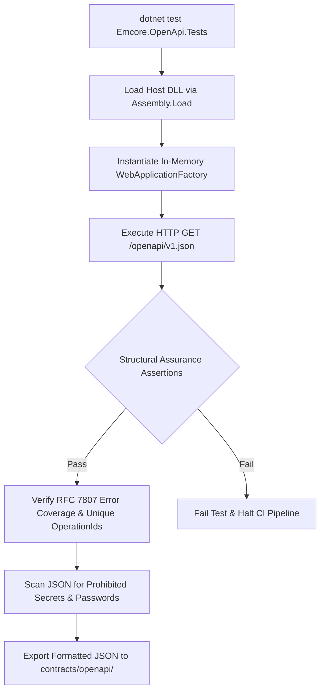

# EMCORE Platform — OpenAPI Contract Export & Automated Testing Guide

**Document Date:** August 2026  
**Tooling Compatibility:** .NET 10 SDK, PowerShell 7+, GNU Bash  
**Primary Engine:** `tests/architecture/Emcore.OpenApi.Tests` (xUnit + WebApplicationFactory)

---

## 1. Overview of Automated Contract Assurance

To prevent documentation drift and guarantee that client SDKs, gateway routing rules, and partner API integrations never fall out of synchronization with backend code, the EMCORE Platform enforces **Automated OpenAPI Contract Testing & Generation**.

Rather than relying on manual file exporting or ad-hoc design tools, all 17 specification documents are compiled directly from actual running entry point binaries inside an automated CI harness using `Microsoft.AspNetCore.Mvc.Testing.WebApplicationFactory`.

---

## 2. Automated Test Architecture (`Emcore.OpenApi.Tests`)

The architectural verification suite is located under `tests/architecture/Emcore.OpenApi.Tests/`. It accomplishes three continuous responsibilities during regular unit test executions:



### Key Verification Assertions
1. **Schema Validation:** Verifies that the JSON payload adheres to OpenAPI version 3.0+ and specifies clear title and semantic versioning strings (`1.0.0`).
2. **Operation Id Uniqueness:** Enumerates every documented HTTP method across all mapped routes to assert that every `OperationId` is non-empty and globally unique across the specification, preventing code-generator duplication faults in SDK generation tools (e.g., NSwag, OpenAPI Generator).
3. **Enterprise Error Coverage:** Asserts that all functional domain endpoints (excluding diagnostic routing like `/health/live`, `/health/ready`, and system utility probes) explicitly document HTTP 500 error scenarios tied to the standardized `"EmcoreProblemDetails"` RFC 7807 payload.
4. **Credential & Secret Scanning:** Inspects the raw generated JSON stream against security rules to ensure private RSA certificates, AWS tokens, database connection strings, or hardcoded operator credentials are never inadvertently embedded inside exposed documentation models.

---

## 3. How to Generate Contracts Locally

Developers modifying endpoint route signatures, parameters, or return DTOs must execute the OpenAPI generation script before committing code to ensure versioned specification files in `contracts/openapi/` remain synchronized.

### Windows (PowerShell) Execution
Run the automated generation helper from the root repository working directory:
```powershell
powershell -File .\scripts\Generate-OpenApi.ps1
```

### Linux / macOS (Bash) Execution
Execute the POSIX shell helper from terminal:
```bash
chmod +x ./scripts/Generate-OpenApi.sh
./scripts/Generate-OpenApi.sh
```

### Expected Output
The automation harness compiles all dependent service assemblies, runs the test suite in release configuration, exports formatted JSON contracts, and outputs verification logs:
```
=================================================================
 EMCORE Platform - Automated OpenAPI Specification Generator     
=================================================================
Target Export Path: C:\DEV\API PROJECT\STOCKOUT\contracts\openapi

[1/2] Executing WebApplicationFactory OpenAPI generation tests...
Passed!  - Failed:     0, Passed:    17, Skipped:     0, Total:    17, Duration: 2 s - Emcore.OpenApi.Tests.dll

[2/2] Verifying generated contract documents...
Successfully exported 17 specification files:
  -> contracts\openapi\emcore-api-gateway\v1\openapi.json (33.91 KB)
  -> contracts\openapi\emcore-identity-access-api\v1\openapi.json (503.84 KB)
  ...
OpenAPI generation completed successfully!
```

---

## 4. CI/CD Integration & Troubleshooting

Both GitHub Pull Request workflows (`pr-validation.yml`) and Main branch integration pipelines (`main-validation.yml`) execute contract validation during pre-merge validation jobs:
- **Contract Verification Failure:** If a developer introduces a new minimal API endpoint without defining return types or error representations, `Emcore.OpenApi.Tests` immediately throws a descriptive xUnit assertion exception, blocking merge operations.
- **Secret Detection Failure:** If a mock password or private RSA block is injected into an XML comment or parameter example, security assertions trigger a pipeline failure with the exact offending string offset.
- **Artifact Preservation:** Upstream CI runners archive the entire `contracts/openapi/` output structure under the build artifact name `emcore-openapi-specs` for safe ingestion into downstream documentation static sites and API consumer developer portals.
