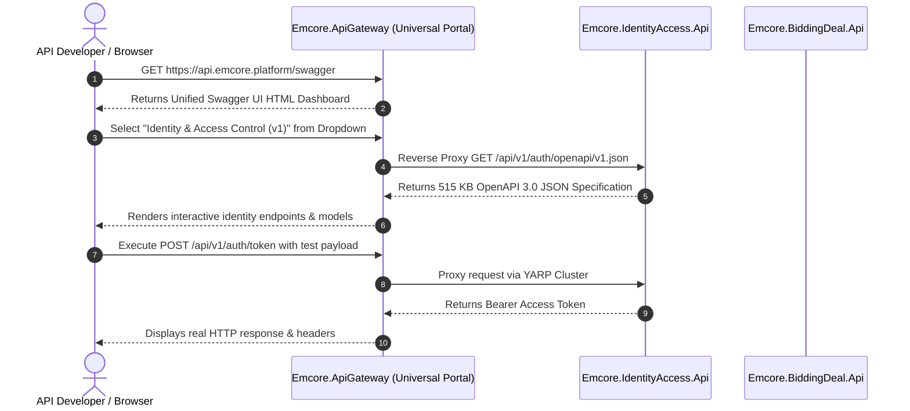

# EMCORE Platform — Centralized Swagger Portal & Developer Gateway Guide

**Document Date:** August 2026  
**Target Audience:** Frontend Engineers, Partner Integrators, Quality Assurance, and API Consumers  
**Portal Host:** `Emcore.ApiGateway` (Default Local Entry Point: `https://localhost:5001/swagger`)

---

## 1. Universal Portal Architecture & Purpose

In a distributed microservice landscape of 17 individual API endpoints and gateway hosts, requiring developers to locate and inspect standalone Swagger UI pages across separate port allocations causes fragmentation and poor discoverability. 

To provide a unified Developer Experience (DevEx), **Emcore.ApiGateway** has been elevated to serve as the **Universal EMCORE Developer Portal**. By combining YARP (Yet Another Reverse Proxy) dynamic routing tables with ASP.NET Core 10 OpenAPI document registries, developers can inspect, mock, and execute requests against every backend domain service directly through a centralized Swagger interactive dashboard.



---

## 2. Dynamic Document Registry (`/api/v1/swagger/registry`)

To support automated discovery, monitoring pipelines, and third-party tooling (such as Postman workspaces or SDK generators), `Emcore.ApiGateway` exposes an authenticated machine-readable specification registry at `/api/v1/swagger/registry`.

When queried via an HTTP GET request, the endpoint returns an array of metadata objects defining all available OpenAPI contracts across the platform:
```json
[
  { "service": "emcore-api-gateway", "name": "API Gateway (Universal Portal Entry Point)", "url": "/openapi/v1.json", "version": "v1" },
  { "service": "emcore-public-bff", "name": "Public Web BFF (Consumer Interface)", "url": "/openapi/v1.json", "version": "v1" },
  { "service": "emcore-portal-bff", "name": "Enterprise Portal BFF (Management Dashboard)", "url": "/openapi/v1.json", "version": "v1" },
  { "service": "emcore-mcp-gateway", "name": "Model Context Protocol (MCP) Gateway", "url": "/openapi/v1.json", "version": "v1" },
  { "service": "emcore-realtime-gateway", "name": "Real-Time SignalR & Event Gateway", "url": "/openapi/v1.json", "version": "v1" },
  { "service": "emcore-identity-access-api", "name": "Identity & Access Control API", "url": "/api/v1/auth/openapi/v1.json", "version": "v1" },
  { "service": "emcore-user-organization-api", "name": "User & Organization Management API", "url": "/api/v1/users/openapi/v1.json", "version": "v1" },
  { "service": "emcore-catalog-listing-api", "name": "Catalog & Listing API", "url": "/api/v1/catalog/openapi/v1.json", "version": "v1" },
  { "service": "emcore-inventory-media-api", "name": "Inventory & Media Operations API", "url": "/api/v1/inventory/openapi/v1.json", "version": "v1" },
  { "service": "emcore-search-discovery-api", "name": "Search & Discovery Query API", "url": "/api/v1/search/openapi/v1.json", "version": "v1" },
  { "service": "emcore-bidding-deal-api", "name": "Bidding & Deal Trading API", "url": "/api/v1/deals/openapi/v1.json", "version": "v1" },
  { "service": "emcore-inspection-trust-api", "name": "Inspection & Trust Verification API", "url": "/api/v1/inspections/openapi/v1.json", "version": "v1" },
  { "service": "emcore-subscription-payment-api", "name": "Subscription & Payment Billing API", "url": "/api/v1/payments/openapi/v1.json", "version": "v1" },
  { "service": "emcore-conversation-realtime-api", "name": "Conversation & Messaging API", "url": "/api/v1/messages/openapi/v1.json", "version": "v1" },
  { "service": "emcore-notification-integration-api", "name": "Notification & Integration Webhook API", "url": "/api/v1/webhooks/openapi/v1.json", "version": "v1" },
  { "service": "emcore-workflow-scheduler-api", "name": "Workflow & Orchestration Scheduler API", "url": "/api/v1/workflows/openapi/v1.json", "version": "v1" },
  { "service": "emcore-audit-reporting-api", "name": "Audit Trail & Compliance Reporting API", "url": "/api/v1/audit/openapi/v1.json", "version": "v1" }
]
```

---

## 3. How to Use the Interactive Portal

1. **Access the Portal:** Navigate your web browser to `https://api.emcore.platform/swagger` (in staging/prod) or `http://localhost:5000/swagger` (during regional deployment development).
2. **Select Target API:** Use the search-enabled top navigation dropdown (`"Select a definition"`) to choose the desired microservice domain. The portal will instantly fetch the JSON document over YARP proxy tunnels and render the corresponding endpoint catalog.
3. **Authenticate:** Click the **Authorize** lock icon at the top right of the dashboard. Input your generated JWT access token in the `Bearer` input box:
   ```
   Bearer eyJhbGciOiJSUzI1NiIsImtpZCI6IkVNQ...
   ```
   Once authorized, Swagger UI will automatically attach the required `Authorization: Bearer <token>` HTTP header across all interactive API submissions.
4. **Inspect Contracts:** Click on any endpoint line item to review detailed descriptive summaries, input validation schemas, required distributed tracking headers, rate-limiting rules, and possible RFC 7807 error responses (`EmcoreProblemDetails`).
5. **Test Executions:** Use the **Try it out** interactive executor to populate simulated payloads and inspect real-time response telemetry.
