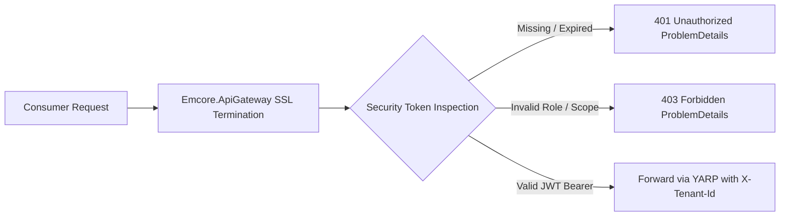

# EMCORE Platform — API Security, Idempotency, and Rate-Limiting Documentation

**Document Date:** August 2026  
**Applicability:** Universal Platform Infrastructure  
**Governing Standard:** EMCORE Enterprise Security Architecture & RFC 7807/W3C Specifications

---

## 1. Authentication & Security Scheme Specifications

To enforce zero-trust network boundaries across external client workloads and internal service boundaries, all EMCORE API hosts document uniform OAuth 2.0 / HTTP Bearer JWT security schemes via the centralized `AddEmcoreSwaggerSecurity()` OpenAPI configuration.

### Security Scheme Properties
- **Scheme Identifier:** `Bearer`
- **Type:** HTTP (`type: http`, `scheme: bearer`, `bearerFormat: JWT`)
- **Location:** Request HTTP header (`Authorization: Bearer <signed-jwt-token>`)
- **Description:** Standardized JSON Web Token issued by `Emcore.IdentityAccess.Api` or recognized OIDC identity providers. Tokens carry cryptographically verifiable cryptographic claims detailing active organizational tenant ID (`tenant_id` / `tid`), delegated user identity (`sub`), and security roles (`roles`).

---

## 2. Distributed Tracing & Enterprise Header Taxonomy

Every API operation documented across the platform exposes optional and required HTTP header contracts via the `EmcoreHeaderTransformer` in `Emcore.BuildingBlocks.Api`. These headers govern distributed log correlation, multi-tenant execution context segregation, and performance debugging.

| Header Name | Type | Presence | Description & Format Requirement |
| :--- | :--- | :--- | :--- |
| `Authorization` | String | **Mandatory** (Non-Public) | Standard OAuth2 Bearer token: `Bearer eyJhbG...` |
| `X-Tenant-Id` | String (UUID) | **Mandatory** (Multi-Tenant)| GUID identifying the operational organization scope. E.g., `ten_01HPX7K7R5YZ2X90WY`. |
| `X-Correlation-Id` | String | *Optional* (Auto-generated)| Client or gateway generated GUID string to track cross-service workflow progression. E.g., `cor_01HPX7K7R5YZ2X90WY`. |
| `X-Request-Id` | String | *Optional* | Enterprise unique transaction tracking identifier. E.g., `req_01HPX7K7R5YZ2X90WY`. |
| `traceparent` | String | *Optional* | W3C Distributed Tracing standard identifier formatted as `<version>-<trace_id>-<parent_id>-<trace_flags>`. E.g., `00-4bf92f3577b34da6a3ce929d0e0e4736-00f067aa0ba902b7-01`. |

---

## 3. Idempotency Key Enforcement

In cloud architectures subject to network retries, connection drops, and load-balancer timeouts, non-idempotent state mutations (such as creating billing invoices, submitting auction bids, or modifying inventory balances) present severe financial risk if duplicated.

Through `EmcoreIdempotencyTransformer`, all transactional modifying routes (`POST`, `PUT`, `PATCH`) automatically document the required idempotency protection headers:
- **Header Name:** `X-Idempotency-Key`
- **Data Format:** Case-sensitive string (recommended: V4 UUID or deterministic client nonce up to 64 bytes).
- **Behavior:** When a consumer submits a mutation request accompanied by an `X-Idempotency-Key`, the platform's distributed idempotency caching infrastructure records the operation fingerprint and final HTTP response outcome. If an identical request arrives within the expiration window (default 24 hours) carrying the same key, the backend bypasses database execution entirely and instantly plays back the original cached response (e.g., `200 OK` or `201 Created`).
- **Conflict Handling:** If an incoming request specifies an existing `X-Idempotency-Key` but alters request body parameters or target URIs, the platform immediately rejects execution and returns **409 Conflict** (`STATE_CONFLICT`) via RFC 7807 problem details.

---

## 4. Rate-Limiting & Traffic Quotas

To protect domain microservices from resource exhaustion, brute-force attacks, and rogue API consumers, EMCORE gateways and API hosts enforce sliding window and fixed token bucket rate limits using ASP.NET Core rate-limiting middleware.

Every documented operational API specifies response rate-limiting metadata headers in accordance with RFC draft standards:

| Response Header | Data Format | Description |
| :--- | :--- | :--- |
| `X-RateLimit-Limit` | Integer | Total permitted API requests allowed within the current evaluation window bucket. E.g., `600`. |
| `X-RateLimit-Remaining` | Integer | Number of unspent requests remaining in the active bucket before denial occurs. E.g., `598`. |
| `X-RateLimit-Reset` | Timestamp (UTC Epoch) | Unix Epoch timestamp (seconds since UTC zero) indicating when the current rate quota window expires and usage counters reset to full limit capacity. |

### Exceeding Quota Thresholds
When an API caller exhausts their allotted request budget (`X-RateLimit-Remaining: 0`), further requests are intercepted before reaching Controllers or Minimal API routing tables. The server rejects the transmission with **429 Too Many Requests** (`RATE_LIMIT_EXCEEDED`) accompanied by an explicit `Retry-After: <seconds>` HTTP header instructing client SDKs how long to suspend requests before reattempting.
