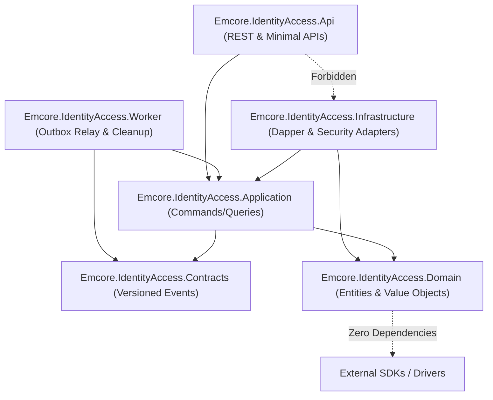

# EMCORE Identity & Access — Architecture & Data Ownership Report

## 1. Executive Summary & Domain Boundary
The **Identity & Access** vertical slice inside the EMCORE platform is strictly engineered to maintain authoritative governance over user credentials, authentication mechanisms, session lifecycles, and identity token issuance. To uphold rigorous security boundaries and prevent architectural coupling across microservices, Identity Access enforces complete physical and logical isolation.

### 1.1 Exclusive Data Ownership
The `EMCORE_IDENTITY_DB` database is exclusively owned by the Identity & Access subsystem. Under zero circumstances are external services permitted to perform database link queries, direct read/write transactions, or view creations against identity tables.

#### Exclusively Owned Entities:
- User accounts (`IDENTITY_USER_ACCOUNT`, `IDENTITY_USER_CREDENTIAL`)
- Password hashes and historical salts
- One-Time Password (OTP) verification factors and recovery challenges (`IDENTITY_VERIFICATION`, `IDENTITY_RECOVERY`)
- Refresh token rotation histories and active user session registries (`IDENTITY_SESSION`, `IDENTITY_REFRESH_TOKEN`)
- Login failure tallies, brute-force lockout timers, and audit logs (`IDENTITY_LOGIN_ATTEMPT`)
- Distributed transactional outbox records and idempotency request logs (`IDENTITY_OUTBOX`, `IDEMPOTENCY_REQUEST`)

#### Strictly Prohibited Entities (Excluded from Identity Database):
- Organization profiles, business legal entities, and branch addresses
- Organizational membership rosters, tenant assignments, and workplace teams
- Business domain role grants (e.g. Seller Administrator, Buyer Auditor, Inventory Officer)
- Marketplace catalog permissions, deal authorizations, or pricing tier entitlements

## 2. Clean Architecture Layer Separation
The service implements strict architectural layering enforced by automated architectural compliance tests (`Emcore.IdentityAccess.ArchitectureTests`).

### 2.1 Layer Dependency Directives
1. **Domain Layer (`Emcore.IdentityAccess.Domain`)**: Contains pure domain business logic, entities (`UserAccount`, `RefreshToken`, `LoginAttempt`), value objects (`UserEmail`, `UserMobile`), and domain event declarations. It maintains zero dependencies on Dapper, SqlClient, ASP.NET Core, or Infrastructure assemblies.
2. **Application Layer (`Emcore.IdentityAccess.Application`)**: Encapsulates orchestration logic inside `IdentityApplicationService`. Defines clean interfaces for repository persistence (`IIdentityRepository`), token generation (`ITokenGenerator`), and hashing (`IPasswordHasher`). Returns standard `AppResult<T>` records representing domain operation outcomes without binding to HTTP transports.
3. **Infrastructure Layer (`Emcore.IdentityAccess.Infrastructure`)**: Implements application interfaces using high-performance Dapper stored procedure executions (`IdentityRepository`), PBKDF2 cryptography (`BCryptPasswordHasher`), and RSA JWT signing (`JwtTokenGenerator`).
4. **API Host (`Emcore.IdentityAccess.Api`)**: Maps incoming external requests forwarded by `Emcore.ApiGateway` to application service methods, formats standard RFC 7807 Problem Details on failures, and manages header tracing propagation.
5. **Relay Worker (`Emcore.IdentityAccess.Worker`)**: Operates out-of-process to reliably poll and relay transactional outbox events to downstream RabbitMQ exchanges and executes automated periodic security data cleanup.

## 3. Cryptographic Security Standards & Hardening
- **Password Cryptography**: Passwords are hashed using **PBKDF2 with HMAC-SHA512** employing 100,000 cryptographic iterations and a randomized 128-bit cryptographic salt. Stored under versioned format `v1:pbkdf2:100000:{salt}:{hash}` to facilitate future algorithmic migration without invalidating legacy user records.
- **JWT & JWKS Signatures**: All issued access tokens are signed using 2048-bit RSA asymmetric cryptography (`RS256`). Public keys are exposed via standard JSON Web Key Set (JWKS) endpoints (`/.well-known/jwks.json`) containing unique Key ID (`kid: emcore-id-key-v1`) metadata to enable zero-trust verification across downstream gateway filters and internal service boundaries.
- **Token Hashing & Zero-Plaintext Policy**: OTP verification tokens, password reset secrets, and refresh tokens are securely generated using cryptographic random bit generators and immediately hashed using SHA-256 before storage. Plaintext tokens exist exclusively inside transient execution memory during initial transmission and are never logged or stored in database persistence layers.
