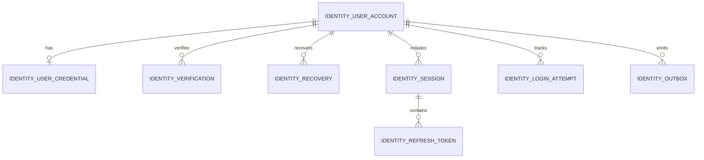

# EMCORE Identity & Access — Database Schema & Stored Procedure Reference

## 1. Database Persistence Strategy
In adherence to EMCORE high-performance enterprise data engineering guidelines, all authoritative operational database access inside `Emcore.IdentityAccess.Infrastructure` is executed exclusively via **Dapper** invoking structured T-SQL **Stored Procedures**. Direct embedded SQL text queries or raw table mutations from code are strictly excluded. Every state-changing procedure encapsulates database mutations within explicit T-SQL transactions (`BEGIN TRANSACTION ... COMMIT TRANSACTION`) with mandatory `SET NOCOUNT ON;` performance optimizations.

## 2. Normalized Relational Table Inventory

### 2.1 Core Identity Tables
- **`IDENTITY_USER_ACCOUNT`**: Primary user identity registry housing ULID identifiers, original/normalized email addresses, normalized mobile numbers, verified state bitflags, and account lifecycle status (`PendingVerification`, `Active`, `Locked`, `Suspended`).
- **`IDENTITY_USER_CREDENTIAL`**: One-to-one credential repository storing versioned PBKDF2-HMAC-SHA512 password hashes, iteration counts, algorithms, and lockout expiration timestamps.
- **`IDENTITY_VERIFICATION`**: Transient token repository for 2-hour OTP email and mobile verification factors stored exclusively as SHA-256 cryptographic hashes.
- **`IDENTITY_RECOVERY`**: Secure challenge repository for 1-hour password reset tokens stored as SHA-256 cryptographic hashes.

### 2.2 Session & Token Lifecycle Tables
- **`IDENTITY_SESSION`**: Master active and historical session ledger tracking device labels, IP addresses, issuance timestamps, and revocation state.
- **`IDENTITY_REFRESH_TOKEN`**: Normalized token rotation family ledger storing SHA-256 hashes of refresh tokens, rotation linkages (`ReplacedByTokenHash`), and revocation indicators to enable instant reuse compromise detection.
- **`IDENTITY_LOGIN_ATTEMPT`**: Audit ledger tracking authentication attempts, failure counts, target IP addresses, and consecutive lockout threshold enforcement.

### 2.3 Reliability & Messaging Infrastructure Tables
- **`IDENTITY_OUTBOX`**: Transactional outbox ledger storing versioned JSON domain event payloads committed atomically during operational state changes.
- **`IDEMPOTENCY_REQUEST`**: Deduplication caching ledger storing request cryptographic hash signatures, operational timestamps, HTTP response status codes, and cached response payloads.

## 3. Authoritative Stored Procedure Inventory
All procedures handle concurrent execution safely via appropriate table locking and transaction scoping.

| Stored Procedure Name | Target Tables Modified / Read | Transaction Scope | Operational Responsibility |
| :--- | :--- | :---: | :--- |
| `dbo.PR_IDENTITY_REGISTER_USER` | `USER_ACCOUNT`, `USER_CREDENTIAL`, `VERIFICATION`, `OUTBOX` | Explicit Transaction | Atomically registers user, creates initial OTP verification challenge, and commits outbox registration event. |
| `dbo.PR_IDENTITY_GET_USER_BY_IDENTIFIER`| `USER_ACCOUNT`, `USER_CREDENTIAL`, `LOGIN_ATTEMPT` | Read-Only (NoLock) | Locates user account by email or mobile and aggregates current lockout failure statistics. |
| `dbo.PR_IDENTITY_VERIFY_ACCOUNT` | `USER_ACCOUNT`, `VERIFICATION`, `OUTBOX` | Explicit Transaction | Validates SHA-256 token hash against active channel challenge; upgrades user status to Active; emits verified outbox event. |
| `dbo.PR_IDENTITY_RECORD_LOGIN_ATTEMPT`| `LOGIN_ATTEMPT`, `USER_CREDENTIAL`, `OUTBOX` | Explicit Transaction | Increments failed attempts or resets tally upon success. Applies time-based account lockout upon exceeding 5 failed tries. |
| `dbo.PR_IDENTITY_CREATE_SESSION` | `SESSION`, `REFRESH_TOKEN` | Explicit Transaction | Creates active user session and records initial SHA-256 hashed refresh token in family lineage. |
| `dbo.PR_IDENTITY_ROTATE_REFRESH_TOKEN`| `SESSION`, `REFRESH_TOKEN`, `OUTBOX` | Explicit Transaction | Validates refresh token hash. If already revoked, marks entire token family compromised and revokes session; otherwise issues new rotation token. |
| `dbo.PR_IDENTITY_REVOKE_SESSION`| `SESSION`, `REFRESH_TOKEN`, `OUTBOX` | Explicit Transaction | Terminates single session by ID or refresh token hash and publishes session revoked outbox notification. |
| `dbo.PR_IDENTITY_REVOKE_ALL_SESSIONS` | `SESSION`, `REFRESH_TOKEN`, `OUTBOX` | Explicit Transaction | Terminates all active sessions owned by user identity (used during logout-all or security compromise mitigation). |
| `dbo.PR_IDENTITY_CHANGE_PASSWORD` | `USER_CREDENTIAL`, `SESSION`, `OUTBOX` | Explicit Transaction | Replaces PBKDF2 hash, terminates existing active sessions across all devices, and commits password change outbox notification. |
| `dbo.PR_IDENTITY_RESET_PASSWORD` | `USER_CREDENTIAL`, `RECOVERY`, `SESSION`, `OUTBOX`| Explicit Transaction | Validates unconsumed reset hash challenge, sets new PBKDF2 hash, marks recovery challenge consumed, and revokes sessions. |
| `dbo.PR_IDENTITY_BEGIN_IDEMPOTENT_REQUEST`| `IDEMPOTENCY_REQUEST` | Explicit Transaction | Evaluates idempotency key and request signature; returns cached response if duplicate or initializes pending lock. |
| `dbo.PR_IDENTITY_COMPLETE_IDEMPOTENT_REQUEST`| `IDEMPOTENCY_REQUEST` | Explicit Transaction | Finalizes idempotent record with real execution HTTP status code and response payload. |
| `dbo.PR_IDENTITY_GET_PENDING_OUTBOX`| `IDENTITY_OUTBOX` | Read-Only (ReadPast)| Polls unassigned outbox records in batch for asynchronous background message broker relay. |
| `dbo.PR_IDENTITY_MARK_OUTBOX_PUBLISHED`| `IDENTITY_OUTBOX` | Explicit Transaction | Marks outbox event as successfully relayed to RabbitMQ exchange. |
| `dbo.PR_IDENTITY_MARK_OUTBOX_FAILED`| `IDENTITY_OUTBOX` | Explicit Transaction | Records relay delivery failure, increments retry attempt tally, and saves error exception details. |
| `dbo.PR_IDENTITY_CLEANUP_EXPIRED_SECURITY_DATA`| `VERIFICATION`, `RECOVERY`, `OUTBOX`, `REFRESH_TOKEN` | Batch Explicit Transactions | Deletes expired OTP factors (>24h), consumed recovery challenges (>24h), published outbox records (>7d), and revoked tokens without lock contention. |
