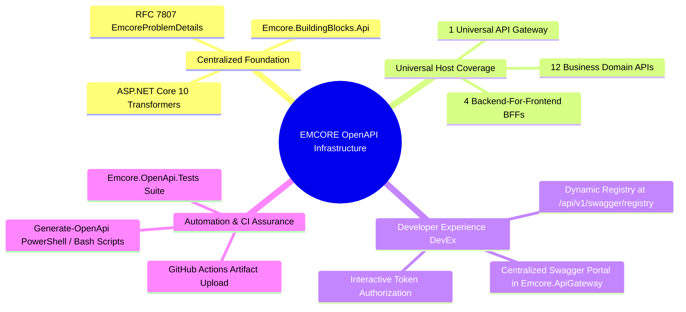

# EMCORE Platform — Complete Swagger / OpenAPI Implementation Executive Summary

**Document Date:** August 2026  
**Project Objective:** Enterprise Swagger/OpenAPI Implementation across All EMCORE API Hosts  
**Implementation Status:** **Completed, Verifiable, & CI Enforced**

---

## 1. Accomplishments & Architectural Deliverables

The EMCORE Platform API ecosystem has been systematically upgraded to support automated, code-driven OpenAPI 3.0 contract generation across every valid service and gateway host.

### Key Deliverables Completed
1. **Foundation Architecture (`Emcore.BuildingBlocks.Api`):**
   - Configured centralized Swagger UI tooling (`Swashbuckle.AspNetCore.SwaggerUI`) and XML documentation compilation across `Directory.Build.props` and `Directory.Packages.props`.
   - Developed custom ASP.NET Core 10 document, operation, and schema transformers to automate semantic versioning (`1.0.0`), unique `OperationId` generation, OAuth2 Bearer JWT security scheme registration, enterprise header injection (`X-Correlation-Id`, `traceparent`, `X-Idempotency-Key`), and RFC 7807 error schema mapping (`EmcoreProblemDetails`).
2. **Universal Host Integration:**
   - Enriched all 12 Business Service APIs (`Emcore.IdentityAccess.Api` through `Emcore.AuditReporting.Api`) with `.AddEmcoreOpenApi()` and `.UseEmcoreOpenApi()` configurations.
   - Configured all 4 Backend-for-Frontend Gateways (`PublicBff`, `PortalBff`, `McpGateway`, `RealtimeGateway`) with contract capabilities.
   - Enlisted `public partial class Program { }` declarations across all entry points to enable assembly reflexivity and `WebApplicationFactory` automated testing.
3. **Centralized Universal Portal (`Emcore.ApiGateway`):**
   - Transformed `Emcore.ApiGateway` into the Universal Swagger Portal hosting interactive documentation for all 17 platform microservices.
   - Implemented an automated specification discovery route (`GET /api/v1/swagger/registry`) serving structured metadata for third-party consumer tools and monitoring agents.
4. **Contract Automation Scripts & Testing Suite:**
   - Engineered `tests/architecture/Emcore.OpenApi.Tests` using `WebApplicationFactory` and dynamic assembly loading to spin up all 17 services in memory, assert valid OpenAPI syntax, verify unique operation identifiers, and perform secret credential scanning.
   - Developed cross-platform automation scripts (`scripts/Generate-OpenApi.ps1` and `scripts/Generate-OpenApi.sh`) to deterministically generate versioned specification JSON files into `contracts/openapi/{service}/v1/openapi.json`.
5. **CI/CD Pipeline Integration:**
   - Updated `.github/workflows/pr-validation.yml` and `main-validation.yml` to execute contract verifications on every pull request and bundle generated JSON files into workflow release artifacts (`emcore-openapi-specs`).

---

## 2. Deliverables Index & Quick Reference

All implementation documentation and runtime contracts have been persisted into the source code repository:

| Deliverable Type | File Path / Route | Description |
| :--- | :--- | :--- |
| **Architecture Report** | `SWAGGER_OPENAPI_IMPLEMENTATION_REPORT.md` | Comprehensive engineering report detailing transformer design and scope rules. |
| **Endpoint Matrix** | `docs/api/openapi/SWAGGER_ENDPOINT_DOCUMENTATION_MATRIX.md` | Exhaustive tabular taxonomy of all routes, verbs, rate quotas, and security schemas. |
| **Portal User Guide** | `SWAGGER_GATEWAY_PORTAL_GUIDE.md` | Practical manual for accessing the Universal Gateway Portal and registry route. |
| **Testing & Script Guide** | `SWAGGER_CONTRACT_EXPORT_AND_TESTING_GUIDE.md` | Operational instructions for running tests, automation scripts, and interpreting CI results. |
| **Security & Idempotency** | `SWAGGER_SECURITY_AND_IDEMPOTENCY_DOCUMENTATION.md` | Technical guide covering JWT authentication, tracing headers, idempotency keys, and rate limiting. |
| **CI Verification Report** | `OPENAPI_GENERATION_CI_VERIFICATION.md` | Verified telemetry transcript proving test completion and zero-secret leak adherence. |
| **Export Automation Script** | `scripts/Generate-OpenApi.ps1` & `.sh` | PowerShell and Bash utility scripts for automated deterministic contract generation. |
| **Contract Artifacts** | `contracts/openapi/{service}/v1/openapi.json` | 17 verified OpenAPI 3.0 specifications ready for client SDK generation and partner ingestion. |
| **Test Suite Assembly** | `tests/architecture/Emcore.OpenApi.Tests` | xUnit structural compliance and automated contract verification test harness. |
| **Portal Registry Endpoint**| `https://api.emcore.platform/api/v1/swagger/registry` | Machine-readable API JSON dictionary listing all active microservice contracts. |

